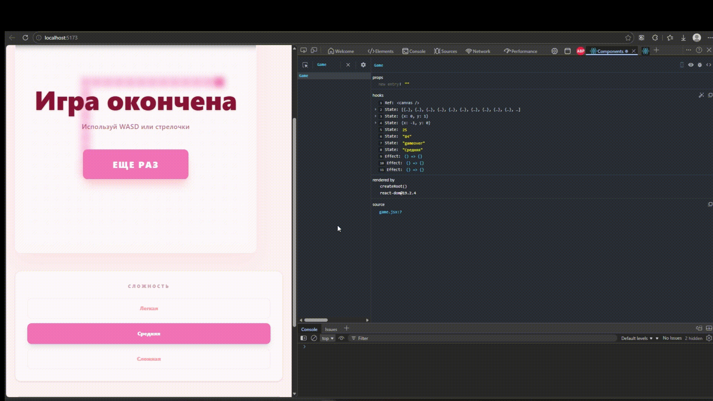

# 🐍 QSnake

Интерпретация классической игры «Змейка», созданная на **React 19**, **Vite** и **Tailwind CSS v4**. Проект выполнен в эстетике розового неона с адаптивным и просторным интерфейсом.

## Особенности

*   **Управление:** Поддержка как классических стрелочек, так и раскладки `WASD`.
*   **Три уровня сложности:** Легкий, Средний и Сложный (меняют скорость игры).
*   **Система рекордов:** Ваш лучший результат сохраняется в `localStorage` и не пропадает после перезагрузки страницы.
*   **Умный спавн:** Еда никогда не появляется внутри тела змейки.

## Демонастрация проекта

## Команды для установки и просмотра:
`npm install`

`npm run dev`

## Deploy
https://snake-tau-bay.vercel.app/

